# Intro

This project investigates the application of machine learning models to the detection of deepfake audio, focusing specifically on speech and song. With the rise of generative AI, synthetic audio has become increasingly realistic and accessible, posing serious threats in areas such as misinformation, fraud, and digital identity security. While many existing approaches rely on convolutional neural networks (CNNs) applied to spectrogram images, this project explores an alternative route: using numerical features extracted from audio signals in an attempt to improve interpretability. The aim is to train models capable of distinguishing real from fake audio while providing insights into which characteristics of speech and music may be indicative of manipulation. Three models—a simple neural network, a complex neural network, and an XGBoost classifier—are used across multiple gender-specific and balanced datasets to rigorously evaluate performance and interpretability. This is motivated by the growing need for explainable, efficient, and scalable deepfake detection methods that can adapt across modalities and demographic subgroups.

# Deepfake Speech Audio Analysis

Deepfake speech audio refers to synthetic human voice clips generated by AI models, commonly using techniques such as text-to-speech (TTS) synthesis, voice conversion, or adversarial learning with generative adversarial networks (GANs). Conventionally, deepfake detection systems for speech transform audio into spectrogram images and apply CNNs to exploit the visual patterns.

<figure style="text-align: center;">

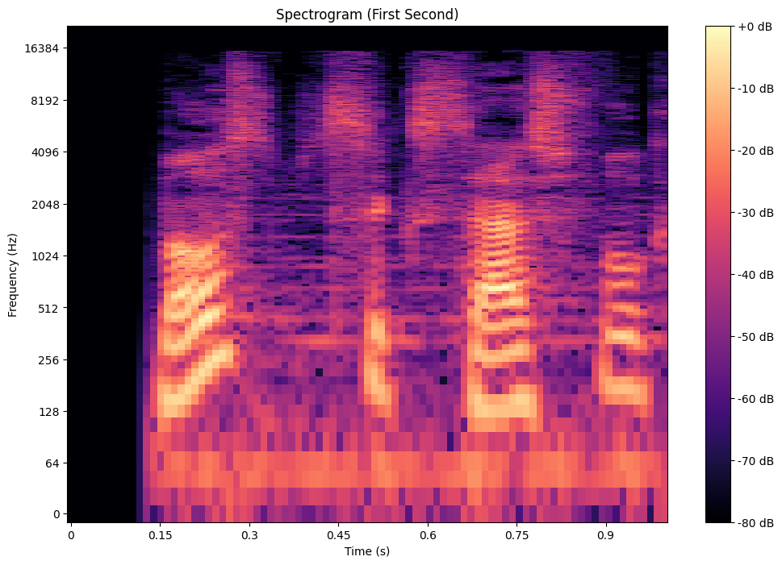

<figcaption>Figure 1: Spectrogram displaying one second of audio</figcaption>

</figure>

A spectrogram is a visual representation of how the frequencies in an audio sample change over time. The horizontal axis shows time, the vertical axis shows frequency, and the color intensity represents the strength (amplitude) of each frequency at each moment. It's commonly used in speech and audio analysis to observe patterns, identify features, or visualize the structure of a sound.

However, instead of image-based modeling, this project uses a numerical approach. The motivation behind this choice is to attempt to improve interpretability and feature-level insight—allowing us to not only detect fakes but also understand what differentiates them at a signal level. Audio features such as MFCCs (Mel-Frequency Cepstral Coefficients), spectral centroids, chroma short-time fourier transforms (STFT), zero-crossing rates, and RMS values are extracted from randomly sampled 1-second segments within each audio file. These features are then used to train and evaluate machine learning models.

The features are computed as follows:

### Chroma Short-Time Fourier Transform (Chroma STFT)

The chromagram represents the intensity of the 12 different pitch classes (C, C#, D, etc.), aggregated across octaves. It is computed using the short-time Fourier transform (STFT), followed by mapping frequencies to pitch classes.

$$
\begin{equation}\text{Chroma}(k, t) = \sum_{f \in \text{bin}(k)} |X(f, t)|\end{equation}
$$

where $X(f,t)$ is the magnitude of the spectrum at time $t$ and frequency bin $f$, and $bin(k)$ represents frequency bins corresponding to pitch class $k$.

The Chroma STFT reveals harmonic and tonal structure. Deepfakes may exhibit unnatural pitch distributions or missing harmonics.

### Root Mean Square (RMS) Energy

The RMS energy measures the average power or loudness of a frame over time. It is computed as:

$$
\begin{equation}\text{RMS} = \sqrt{\frac{1}{N} \sum_{i=1}^{N} x[i]^2}\end{equation}
$$

where $x[i]$ is the audio amplitude at sample $i$, and $N$ is the number of samples.

Real human speech tends to have dynamic loudness patterns, whereas fake audio may have flat or overly compressed energy.

### Spectral Centroid

The spectral centroid indicates the "center of mass" of the frequency spectrum:

$$
\begin{equation}\text{Centroid} = \frac{\sum_f f \cdot |X(f)|}{\sum_f |X(f)|}\end{equation}
$$

where $f$ is the frequency bin, and $∣X(f)∣$ is the magnitude of the Fourier Transform at frequency\$$f$.

A higher centroid typically implies a brighter or sharper sound. Deepfakes may shift the centroid due to unnatural high-frequency components or missing formants.

### Spectral Bandwidth

Spectral bandwidth describes how widely the energy is spread around the spectral centroid:

$$
\begin{equation}\text{Bandwidth} = \sqrt{\frac{\sum_f (f - \mu)^2 \cdot |X(f)|}{\sum_f |X(f)|}}\end{equation}
$$

where $f$ is the frequency, $\mu$ is the spectral centroid, and $∣X(f)∣$ is the magnitude spectrum.

A wider bandwidth can indicate noisy or complex signals. AI generated signals might have unusually wide or narrow bandwidths due to the current nature of synthesis techniques.

### Spectral Rolloff

The rolloff frequency is the point below which a specified percentage of the total spectral energy lies:

$$
\begin{equation}\sum_{f=0}^{f_{\text{rolloff}}} |X(f)| = \alpha \sum_{f=0}^{f_{\text{max}}} |X(f)|\end{equation}
$$

where $X(f)$ is the magnitude of the STFT at frequency bin $f$, $f_{\text{rolloff}}$ is the rolloff cutoff frequency bin, $f_{\text{max}}$ is the highest frequency bin considered in the STFT, and $\alpha$ is the rolloff percentage threshold (usually 85%) of total spectral energy.

This metric gives an idea of the distribution of spectral energy. Deepfakes with poor high-frequency modeling may cause this cutoff to be lower than expected.

### Zero-Crossing Rate (ZCR)

ZCR is the rate at which the signal changes sign, which reflects the noisiness or granularity of a signal:

$$
\begin{equation}\text{ZCR} = \frac{1}{N-1} \sum_{i=1}^{N-1} \mathbf{1}_{\{x[i] \cdot x[i+1] < 0\}}\end{equation}
$$

where $x[i]$ is the aplitude of the audio signal at sample at index $i$, $N$ is the total number of samples in the frame, and $1_\text{{...}}$ is the indicator function equal to 1 if its condition is true, 0 otherwise.

Real speech, especially voiced segments, have a relatively low ZCR, while fake or synthetic speech may introduce unnaturally high or low zero-crossing patterns.

### Mel-Frequency Cepstral Coefficients (MFCCs)

MFCCs are derived from the log power spectrum of the audio signal mapped onto the Mel scale, which approximates the human auditory system. The process includes:

-   Applying STFT

-   Converting the frequency axis to the Mel scale

-   Taking the log of the power spectrum

-   Applying the Discrete Cosine Transform (DCT):

$$
\begin{equation}\text{MFCC}_n = \sum_{k=1}^{K} \log(S_k) \cdot \cos\left[\frac{\pi n (k - 0.5)}{K}\right]\end{equation}
$$

where $M$ is the number of Mel filter banks applied to the power spectrum, $S_\text{m}$ is the energy (log amplitude) in the $m$-th Mel frequency filter bank, $n$ is the cepstral index, representing how many coefficients to compute.

MFCCs are highly effective at capturing timbral and phonetic characteristics. Subtle inconsistencies in pronunciation, articulation, or voice quality caused by generative models can be detected through MFCC anomalies. However, direct interpretability of the MFCCs remains a challenge, as each coefficient captures very fine details of spectral signal shape. Generally,

-   MFCC1 is correlated with the overall energy or loudness of the signal.

-   MFCCs 2-4 capture broad spectral signals, usually related to vowel quality and unique speaker identity.

-   MFCCs 5-13 capture finer spectral details that can be interpreted as phonetic features, such as subtle vocal tract variations, pitch range, and nasality.

-   MFCCs 14-20 capture even finer microstructure of the signal, such as rapid fluctuations and subtle spectral edges. These may include artifacts or channel-specific noise, especially in low-quality or fake audio.

For the training data, the first 20 cepstral coefficients are extracted, derived with 40 Mel filter banks.

For this analysis, each model is first trained exclusively on male speakers and evaluated on female speakers, then vice versa. This setup evaluates the model’s ability to generalize across gender. Subsequently, the same models are trained on a fully balanced dataset (equal real/fake samples, equal male/female representation) and tested holistically. Model performance metrics and feature importances are then analyzed.

## Dataset

The DEEP-VOICE dataset from Kaggle is used here, which contains real and AI-generated speech produced through Retrieval-based Voice Conversion (RVC). Real speech samples are taken from eight public figures, and fake speech is generated by converting one speaker’s voice to another’s using RVC. This works by extracting vocal features from the source speaker, retrieving acoustically similar segments from a database of the target speaker’s voice, and reconstructing the speech to sound like the target speaker. In the dataset, vocals are extracted from the original audio, converted using this retrieval-based process, and then overlaid onto the original background ambience to create convincing DeepFake audio samples.

While the dataset provides pre-extracted features, the raw audio was re-processed to maintain full control over feature extraction and variable handling (e.g., grouping by speaker gender).

## Data Pre-processing

To begin, each audio file was analyzed in 120 1-second chunks, randomly sampled to capture representative voice activity. From each chunk, the aforementioned features were extracted.

The dataset was then grouped by speaker gender and made into three subsets: male-only, female-only, and a full balanced set. For each subset, equal numbers of real and fake samples were ensured through random undersampling of the majority class. For the full dataset, equal male/female representation was maintained.

To ensure model integrity and prevent data leakage, speaker identities were used as grouping units for all data splits. No speaker’s voice appeared in training, cross-validation, or test sets.

## Feature Importance

To interpret each of the models' decision-making processes, SHAP (SHapley Additive exPlanations) is used to compute feature importance scores. Using samples from from the training and test datasets, SHAP values are computed to show how each input feature contributes to the model's predictions. The resulting summary plot helps identify which features consistently influence predictions across samples. Each model's importance plot will be shown, and in the post training analysis, model performance, as well as feature importance will be analyzed comprehensively.

## Simple Neural Network

The simple Neural Network consists of three linear layers with ReLU activation functions, taking in input features and producing binary classification outputs. Key training hyperparameters include a learning rate of 0.001, batch size of 32, and training over 10 epochs. To evaluate model performance robustly, 10-fold cross-validation is employed, where the data is split into 10 parts, rotating through training and validation roles to reduce overfitting and better estimate generalization. After training, the final model is evaluated on a held-out test set to report overall accuracy.

### Male Model

The male-only simple neural network achieved high performance on its own test set, with a 96% accuracy. When evaluated on the full female dataset, the model achieved an impressive 84% accuracy, given that it was trained exclusively on male data.

::: {style="text-align: center;"}
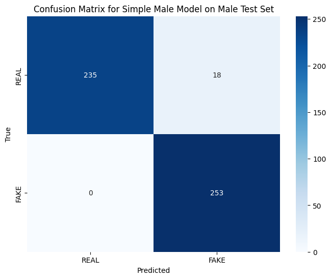 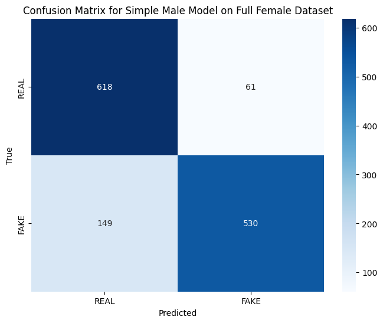

<figcaption>Figure 2: Confusion Matrices for Simple Male Neural Network on Male and Female data</figcaption>
:::

As seen in the confusion matrices, the simple male model never misclassifies fake samples and rarely misclassifies real ones. However, when applied to the female dataset, the model exhibits a slight bias toward predicting samples as real.

Next, the SHAP feature importance plot for the simple male model can be examined to gain insight into the model’s decision-making process and understand which features most strongly influence its predictions.

<figure style="text-align: center;">

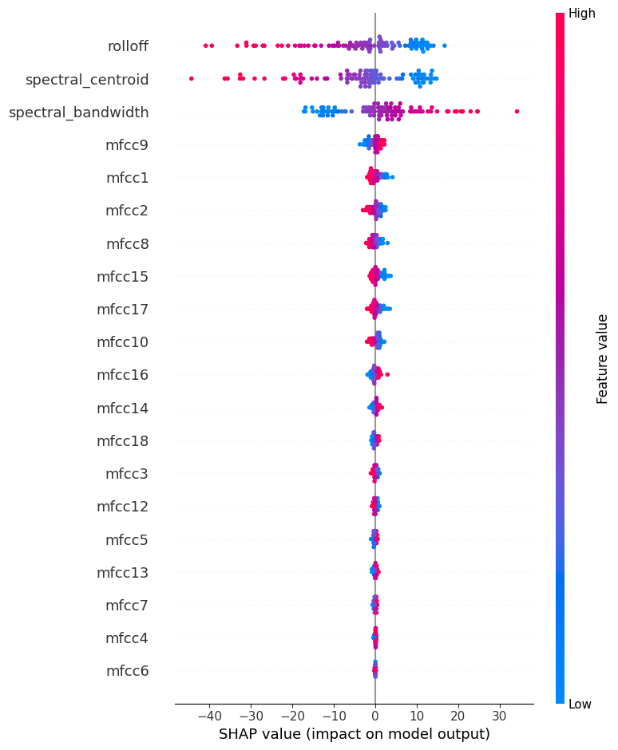

<figcaption>Figure 3: Simple Male Neural Network SHAP plot</figcaption>

</figure>

Each colored point on the SHAP summary plot represents an individual prediction and reflects how a specific feature influences the model’s output. Features are listed on the left by importance, while the color gradient on the right indicates the feature value—blue for low values, red for high. For example, rolloff emerges as the most influential feature of this model. Lower rolloff values consistently push predictions toward the positive (fake) class, while higher values nudge predictions toward the negative (real) class. Similarly, MFCC6 was found to be the least important, where high and low values minimally impact predictions. These patterns do not represent hard rules, but rather highlight general tendencies learned by the model. It is also important to mention that these are the top 20 feature importances, and not all features that were computed are shown in the plot.

As mentioned earlier, the post training analysis will involve a deeper examination of feature importance interpretations and model-specific performance differences—for example, (spoiler!) why the simple male model generalizes better to female data than the simple female model does to male data. The goal is to find liguistically interpretable insights into a model’s decision making process.

### Female Model

The female-only simple neural network performed very well on its own test set, with a 96% accuracy, similar to the male model's performance. However, it performed very poorly on the full male dataset, only achieving a 51% accuracy—slightly better than a coinflip.

::: {style="text-align: center;"}
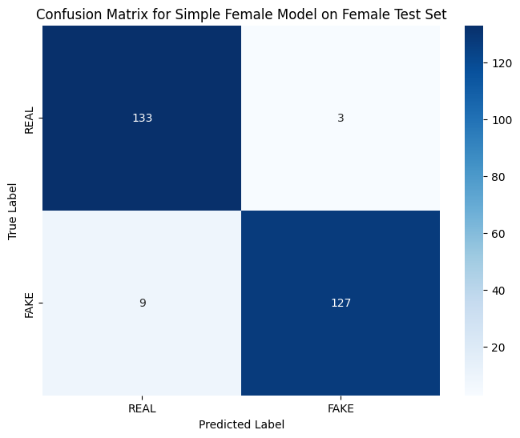 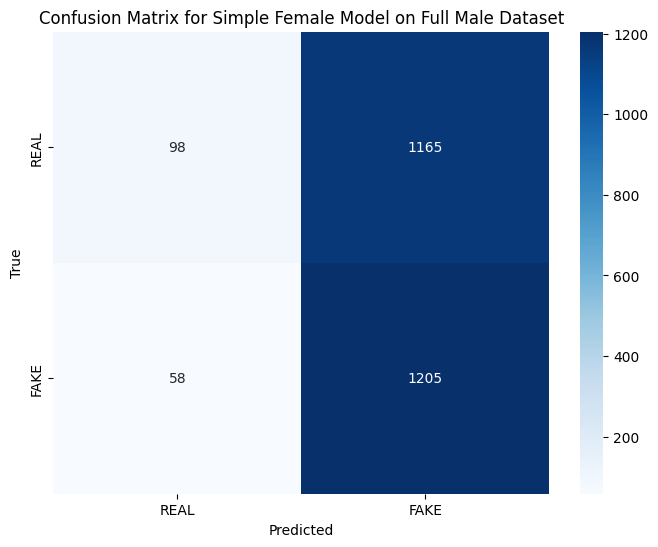

<figcaption>Figure 4: Confusion Matrices for Simple Female Neural Network on Male and Female data</figcaption>
:::

As seen in the confusion matrices, the female simple neural network model makes balanced, accurate predictions on its own test set, but when applied to the full male dataset, its predictions became heavily biased toward the fake class.

Viewing the SHAP importance plot,

<figure style="text-align: center;">

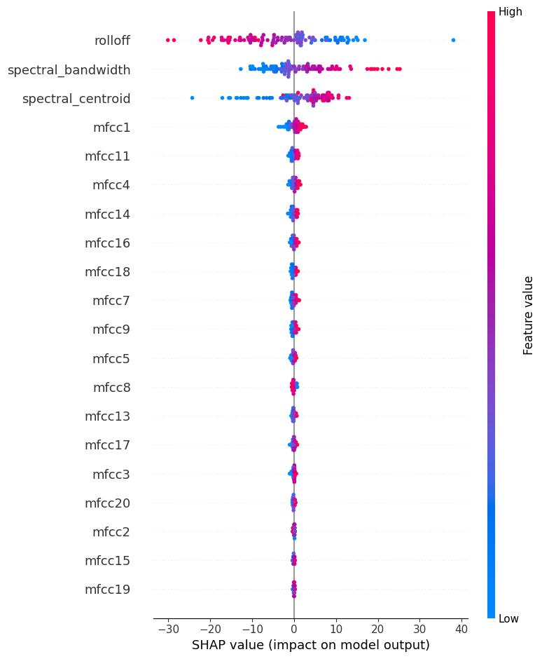

<figcaption>Figure 5: Simple Female Neural Network SHAP plot</figcaption>

</figure>

One notable observation is that the effect of spectral centroid appears reversed compared to the simple male model. In the female model, low spectral centroid values tend to push predictions toward the real class, while high values skew predictions toward the fake class. The top three features are the same, but in a different order.

### Full Model

The full simple model performs moderately well on its test set, achieving an accuracy of 87%. Its limited performance is likely due to the simplicity of the model architecture, which may not be sufficient to capture the complex patterns needed to distinguish real from fake audio across both male and female voices.

<figure style="text-align: center;">

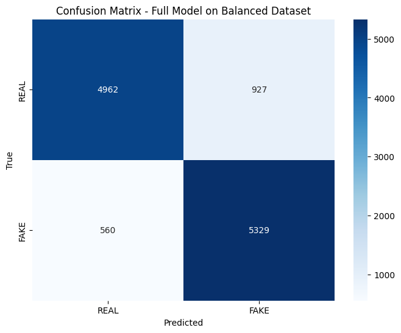

<figcaption>Figure 6: Confusion Matrix for Simple Full Neural Network on Test Set</figcaption>

</figure>

The model's predictions show a slight bias toward the fake class. Other than that, the simple full model's predictions are relatively balanced.

Turning to the SHAP importance plot,

<figure style="text-align: center;">

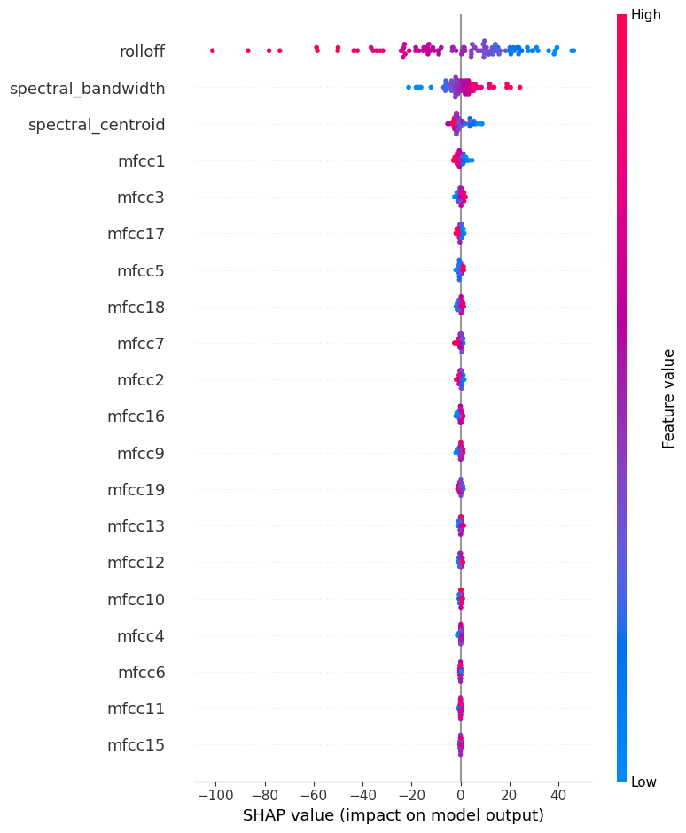

<figcaption>Figure 7: Simple Full Neural Network SHAP plot</figcaption>

</figure>

The full model shares the same top three most important features as the male and female models, though the order differs slightly. Rolloff consistently ranks among the top features across all three simple models and shows a stable influence on predictions, suggesting it captures a robust signal relevant to detecting fake audio regardless of gender.

## Increased Complexity Neural Network

The Complex Neural Network model introduces a deeper architecture. It consists of five fully connected layers, with progressively decreasing hidden dimensions (256 → 128 → 64 → 32 → 1). Each of the first four layers is followed by batch normalization to stabilize learning, ReLU and Swish activation functions for non-linearity, and dropout with a rate of 0.3 to prevent overfitting. The final layer uses a sigmoid activation to output probabilities. The model is trained using a 10-fold stratified cross-validation loop to ensure robustness across splits, with binary cross-entropy as the loss function and the Adam optimizer (learning rate = 0.001). Training is performed for 10 epochs with a batch size of 32.

### Male Model

The more complex male model performed well on its own test set, achieving 95% accuracy. However, its accuracy dropped sharply to 54% when evaluated on the female dataset.

::: {style="text-align: center;"}
 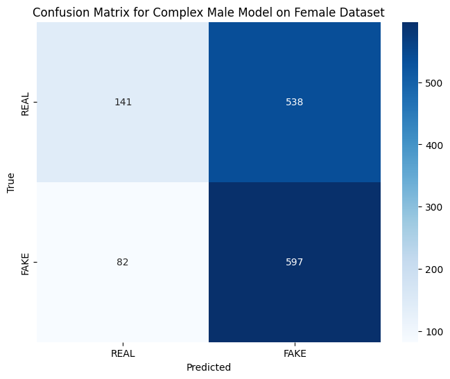

<figcaption>Figure 8: Confusion Matrices for Increased Complexity Male Neural Network on Male and Female data</figcaption>
:::

From the confusion matrices, predictions for the complex male model on the female data are biased towards the fake class, almost always predicting a sample as fake.

Looking at the SHAP importance plot,

<figure style="text-align: center;">

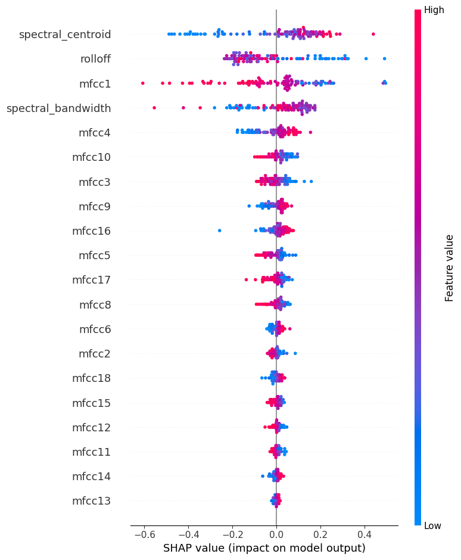

<figcaption>Figure 9: Increased Complexity Male Neural Network SHAP plot</figcaption>

</figure>

Now, we see that MFCC1 is among the top 3 most important features for prediction, where higher values tend to push the model towards the real class, and lower values push it towards the fake class. It is also important to note that some features, such as spectral bandwidth, exhibit mixed interpretability. In this case, both high and low values appear to push predictions toward the real class, which aligns with the nature of a complex model.

### Female Model

The complex female-only model performed well on its own test set, achieving 96% accuracy on its test set. However, on the full male data, it decreased to 74% accuracy.

::: {style="text-align: center;"}
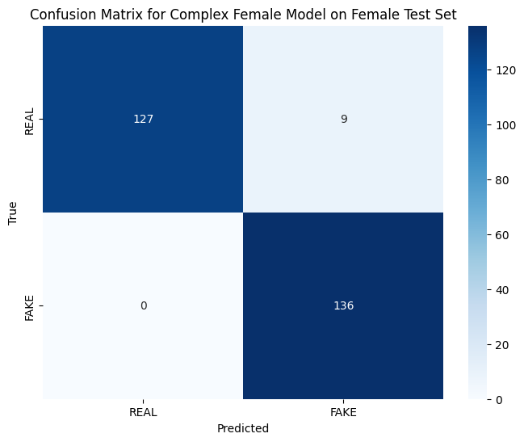 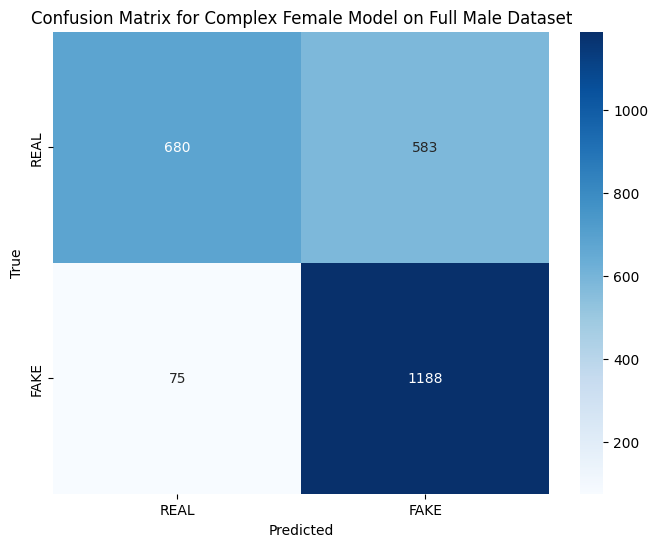

<figcaption>Figure 10: Confusion Matrices for Increased Complexity Female Neural Network on Male and Female data</figcaption>
:::

The predictions are balanced on its own test set, only misclassifying some real samples as fake. However, on the full male data, predictions are somewhat biased towards the fake class, where almost all misclassifications were predicted as fake.

Viewing the SHAP plot,

<figure style="text-align: center;">

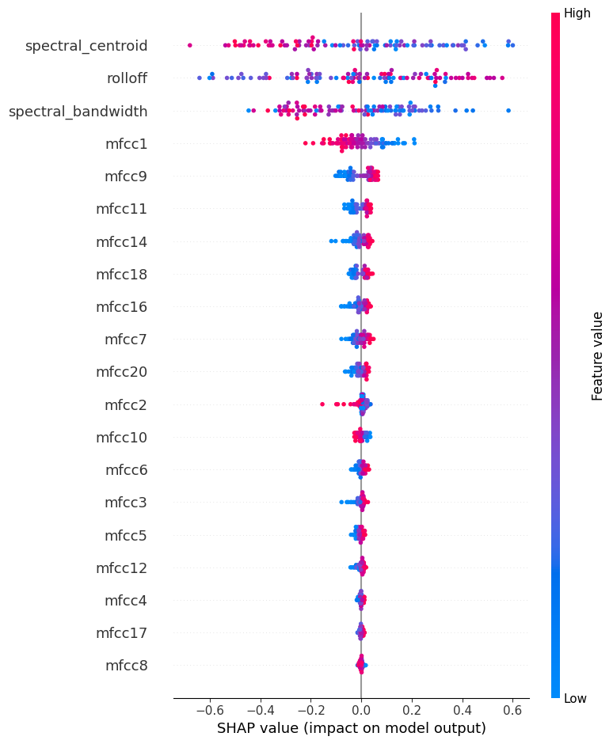

<figcaption>Figure 11: Increased Complexity Female Neural Network SHAP plot</figcaption>

</figure>

The complex female model shows even greater mixed interpretability among features, with its top three features all exhibiting non-uniform patterns—where both high and low values contribute to similar prediction outcomes, again aligning with the expectations of a more complex model.

### Full Model

The full complex model performs very well on its test set, with a 98% accuracy.

<figure style="text-align: center;">

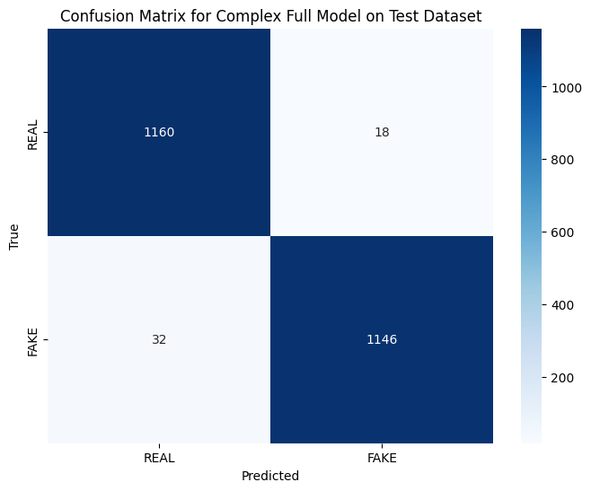

<figcaption>Figure 12: Confusion Matrix for Increased Complexity Full Neural Network on Test Set</figcaption>

</figure>

The predictions of the complex full model are balanced, and samples are rarely misclassified.

Looking at the SHAP plot,

<figure style="text-align: center;">

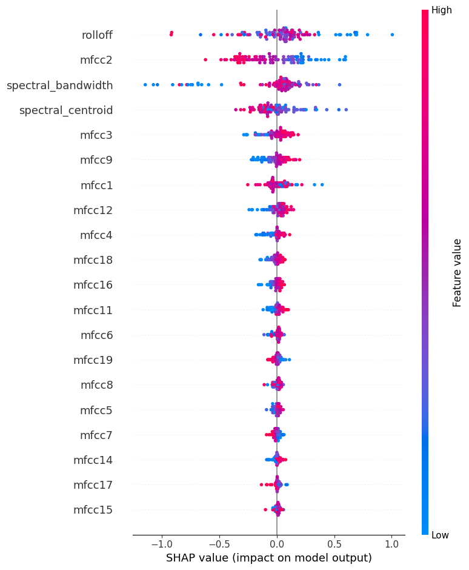

<figcaption>Figure 13: Increased Complexity Full Neural Network SHAP plot</figcaption>

</figure>

The complex model still exhibits mixed interpretability, but MFCC2 seems to be stable, where higher values tend to push predictions towards real, and lower values push predictions towards fake.

## Extreme Gradient Boosting (XGBoost)

The XGBoost model is trained using a logistic loss (binary logistic objective) with a learning rate (eta) of 0.1, a maximum tree depth of 6, and both row (subsample) and column (colsample_bytree) sampling rates set to 0.8 to reduce overfitting. Training runs for up to 100 boosting rounds, but early stopping halts training if no improvement is seen in the evaluation set within 10 rounds. This setup leverages the speed and regularization capabilities of XGBoost, making it well-suited for tabular binary classification tasks with potential nonlinear feature interactions. The training was done in one pass without cross validation.

### Male Model

The male XGBoost model did well on its own test set with a 99% accuracy. However, evaluating it on the full female data yields a 73% accuracy.

::: {style="text-align: center;"}
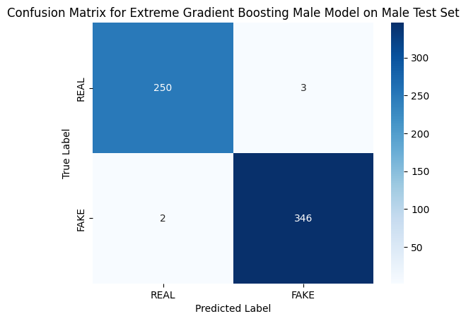 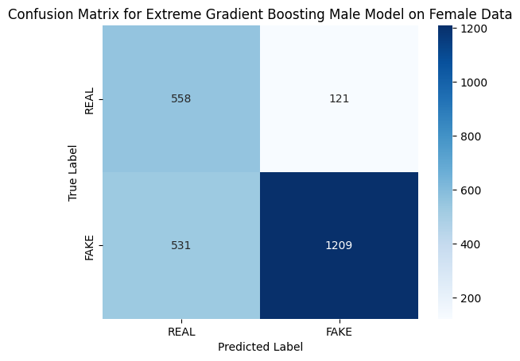

<figcaption>Figure 14: Confusion Matrices for XGBoost Male Model on Male and Female data</figcaption>
:::

The male model makes balanced predictions on its test set, but misclassifies fake audio as real when making a prediction on female audio samples, getting the real class correct only about half the time, but the fake class correct almost all the time.

Taking a look at the SHAP plot,

<figure style="text-align: center;">

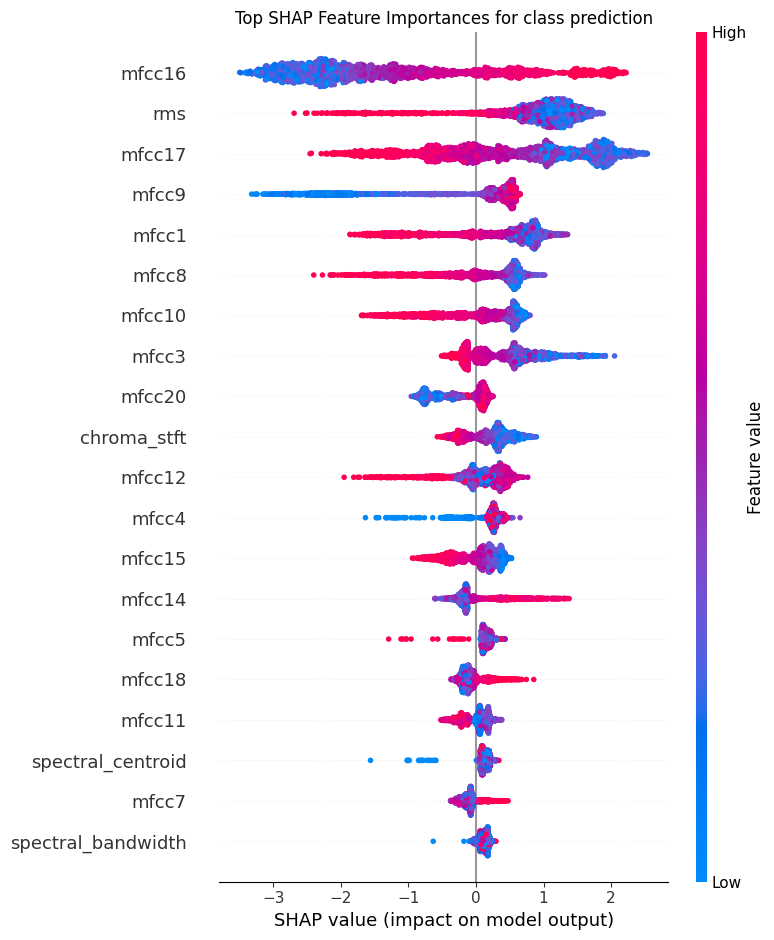

<figcaption>Figure 15: XGBoost Male Model SHAP plot</figcaption>

</figure>

Here, the top 5 features are among the least interpretable, with the exception of RMS energy. Features also exhibit mixed interpretability at times, such as MFCC16 when skewing predictions towards real, and RMS energy when skewing predictions towards fake.

### Female Model

The female XGBoost model did well on its own test set with a 99% accuracy. However, it only reaches a 60% accuracy on the full male dataset.

::: {style="text-align: center;"}
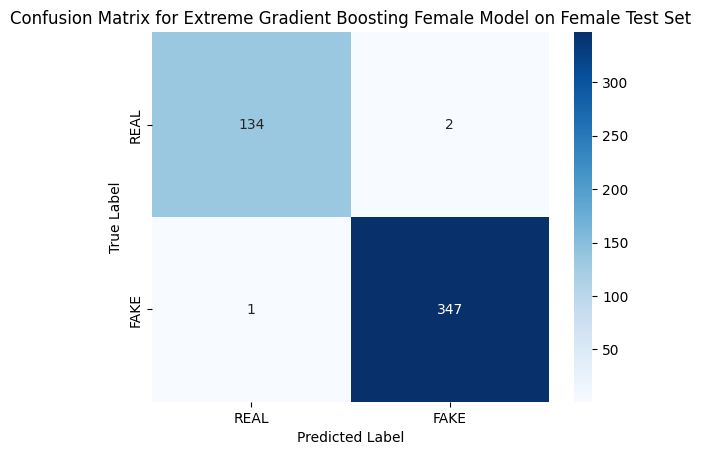 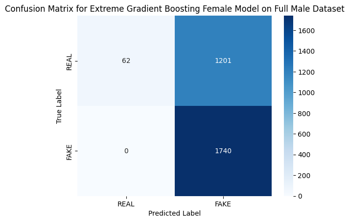

<figcaption>Figure 16: Confusion Matrices for XGBoost Female Model on Male and Female data</figcaption>
:::

\*The predictions are balanced on the model's own test set, but almost always predicts a sample as fake when classifying male samples..

Viewing the SHAP plot,

<figure style="text-align: center;">

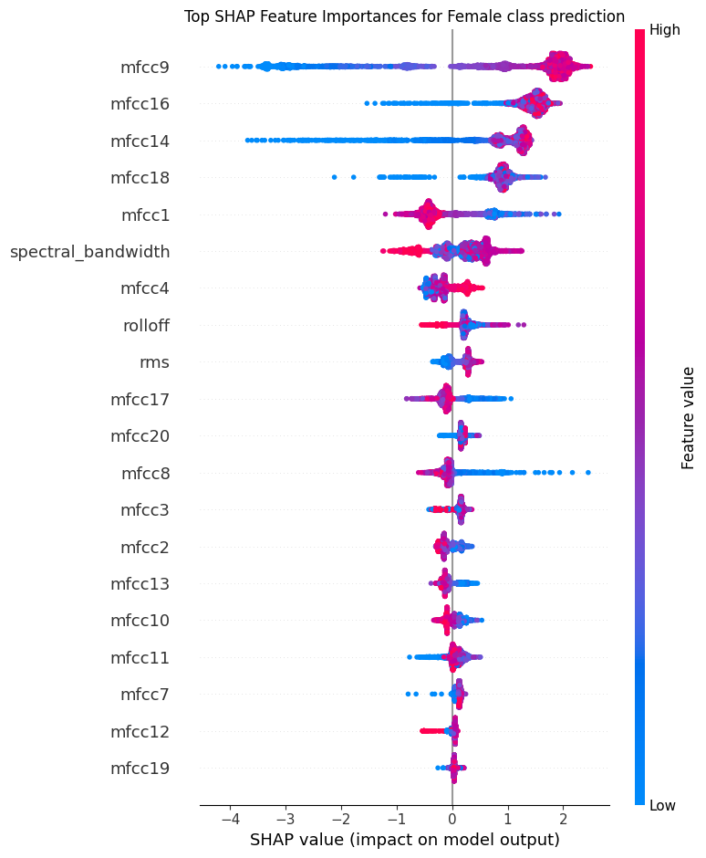

<figcaption>Figure 17: XGBoost Female Model SHAP plot</figcaption>

</figure>

We see again that the most important features are the least interpretable, with a similar pattern of mixed interpretability for some features, such as spectral bandwidth.

### Full Model

The full XGBoost model achieves 99% accuracy on the test set.

<figure style="text-align: center;">

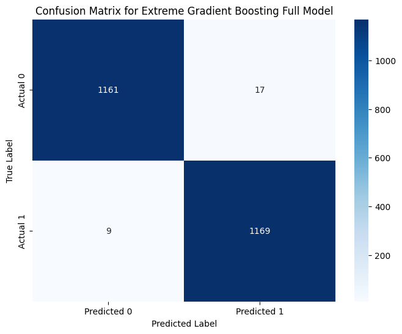

<figcaption>Figure 18: Confusion Matrix for Full XGBoost Model on Test Set</figcaption>

</figure>

Its predictions are balanced, where a label of 0 corresponds to real, and 1 is fake.

Now we move on to interpreting the SHAP plot.

<figure style="text-align: center;">

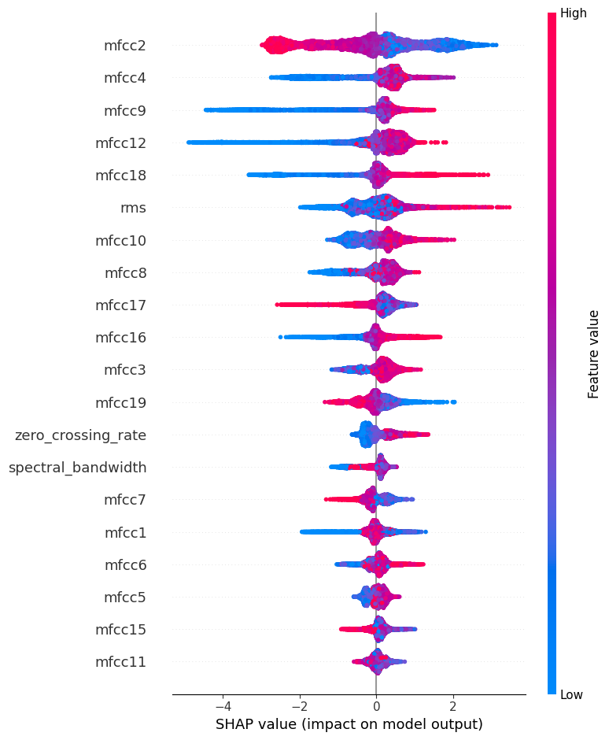

<figcaption>Figure 19: XGBoost Full Model SHAP plot</figcaption>

</figure>

Here, the least interpretable features are among the top 5 most important, as with the other XGBoost models. This indicates that generally, the XGBoost algorithm decides that unique fine details of spectral signal are the most significant factors of classifying fake and real speech audio.

## Post-training Analysis and Interpretation

Here, feature importances will be compared and contrasted across the different models to identify consistent patterns as well as model-specific differences in how features influence predictions.

Despite being trained exclusively on male data, the simple male model performed well on the full female dataset, outclassing the complex male neural network and XGBoost. This suggests that the model may have captured some gender-independent acoustic patterns that generalize better than expected.

The complex male neural network almost always classifies female audio as fake. In the raw male data, real audio typically has lower spectral centroid values, while fake audio tends to have higher values. In contrast, the female data exhibits the opposite pattern—higher spectral centroid values are associated with real audio. Consequently, when the male model encounters female audio with a high spectral centroid, it incorrectly associates this with the fake class. SHAP analysis of the model shows that higher values of spectral centroid—the most influential feature in the model—consistently contribute toward predictions of the fake class in the male data. Taking a look at the distributions of spectral centroid in the raw data, this pattern is visible. In this instance, SHAP interpretations agree with manual analysis.

<figure style="text-align: center;">

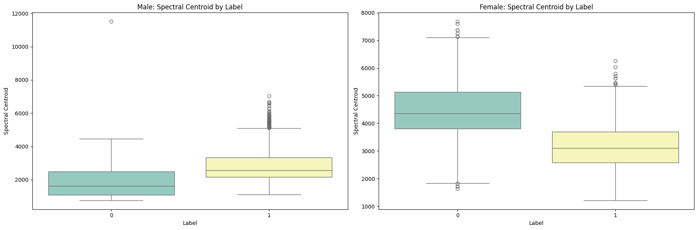{width="99%"}

<figcaption>Figure 20: Spectral Centroid: Real vs. Fake by Gender</figcaption>

However, as mentioned previously, spectral centroid appeared among the top three most important features for both the simple male and female models, but those two models exhibited essentially opposite decision patterns for some features. For example, while higher spectral centroid values in the male model tended to push predictions toward the real class, in the female model, those same high values skewed predictions toward the fake class. When going back to the distributions of spectral centroid across gender and label groups, this pattern is not clearly reflected.

This discrepancy reiforces the limitation of SHAP-based interpretations. While SHAP provides insight into how a model tends to use individual features, it does not account for the complex, nonlinear interactions that ultimately drive predictions. As such, SHAP should not be interpreted in isolation or taken to imply simple one-to-one feature-label relationships—e.g., “high spectral centroid = fake.” For this reason, any interpretation drawn from SHAP should be considered with caution, particularly when comparing it directly to raw feature distributions.

Moving on, similar to the simple female neural network, the female XGBoost model also performed poorly on the male dataset, with both models almost always predicting audio as fake. This happened despite the two models having entirely different feature importance rankings and magnitudes. This suggests that model complexity and archetecture play less of a part in accurate classification, and that limitations in the training data could be the culprit, which is expected. However, interestingly, the complex female neural network generalized to male audio more effectively than the simple female neural network, achieving a 74% accuracy. Examining the SHAP plots for both models, the complex model exhibits a high degree of variability, where features like rolloff can take on either high or low values and still contribute to predictions of the real class. In contrast, the simple model displays more consistent behavior, where each feature’s directionality (high vs. low) has a clearer and more predictable impact on whether a sample is classified as real or fake. This suggests that the complex model may have discovered a nonlinear combination of features that fits the female data well and happens to generalize moderately to male data.

The complex male neural network performed significantly worse on the female dataset compared to the simple male neural network. This is likely due to the increased model complexity, which makes it more prone to overfitting the training data—in this case, male-specific acoustic patterns. Additionally, the SHAP feature importance plots reveal noticeable differences between the two models. Not only do the top features differ in ranking, but some—such as spectral centroid—also exhibit reversed directional influence. For example, while low spectral centroid values may push predictions toward the fake class in the simple model, they contribute to real predictions in the complex model. These inconsistencies further suggest that the complex model has captured more intricate, but less transferable, decision rules.

For the simple male model, low spectral bandwidth values tend to push predictions toward the real class. However, in the raw female dataset, the relationship is reversed—fake samples are more likely to have lower spectral bandwidth values. This mismatch likely contributes to the model’s misclassification of female audio, as it incorrectly associates low spectral bandwidth with authenticity. This pattern is visible when comparing the distributions of spectral bandwidth in the male and female datasets.

</figure>

<figure style="text-align: center;">

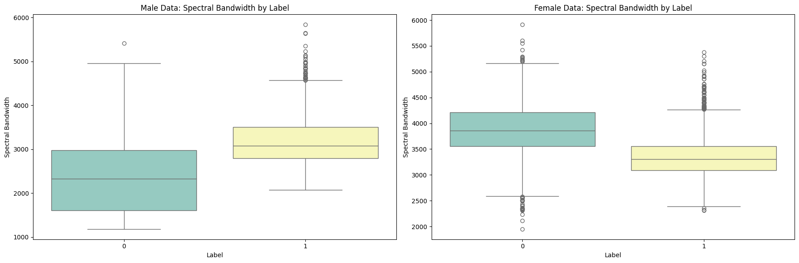

<figcaption>Figure 21: Spectral Bandwidth: Real vs. Fake by Gender</figcaption>

</figure>

In summary, model complexity plays a nuanced role in generalization of these models across gender. In most cases, increased complexity leads to reduced generalization, as more complex models are prone to overfitting patterns specific to their training data. However, there are some exceptions, where complex models coincidentally discover feature interactions that enable moderate cross-gender generalization. These instances highlight the unpredictable nature of deep learnig models and reinforce the importance of careful evaluation when extending model predictions to out-of-distribution groups.

# Deepfake Song Audio Analysis

The second half of this project focuses on deepfake song audio, generated by AI models trained to synthesize singing voices. Similar to speech deepfakes, these song deepfakes are typically detected using CNNs on spectrogram images. However, the same feature-based numeric extraction used in the speech analysis is applied here.

## Datasets

Explain sonics dataset, suno and udio generator

## Data pre-processing

Preprocessing for the deepfake song dataset followed a similar philosophy to the speech pipeline, with adjustments tailored to the structure of musical recordings. For each song, 120 seconds of audio were randomly sampled. These 120-second clips were then divided into sequential 1-second intervals for feature extraction.

To prevent data leakage and ensure generalizable model evaluation, all train/test and cross-validation splits were song-aware. Specifically, all 1-second samples from a given song were grouped together and kept within the same fold or partition. This ensured that no information from a single song appeared in both training and testing sets, preserving the integrity of the evaluation. Balanced representation of real and fake samples was also maintained through class-aware sampling where necessary.

After the data were extracted and grouped, features were normalized.

Grid search was used to find the best hyperparameters

## Extreme Gradient Boosting

Explain hyperparameters of the best model, lr 0.3, max depth 5, n estimators 200, 99.8% accuracy,

<figure style="text-align: center;">

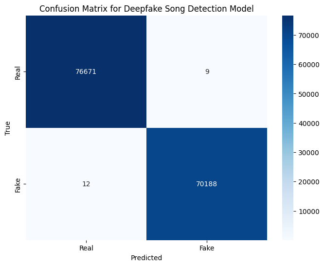

<figcaption>Figure 22: Confusion Matrix for Deepfake Song XGBoost Model on Test Set</figcaption>

</figure>

\*now we view shap

<figure style="text-align: center;">

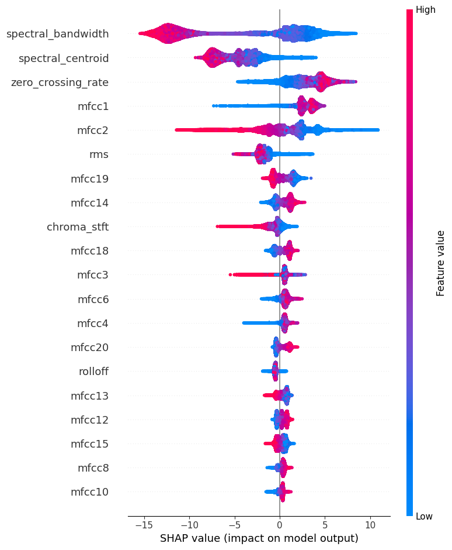

<figcaption>Figure 23: Deepfake Song XGBoost Model SHAP plot</figcaption>

</figure>

\*interpret comprehensively, this actually has actionable insights, as the most interpretable features are at the top 3

## Deployment

A simple Hugging Face Streamlit app was made
